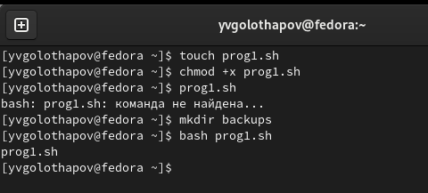
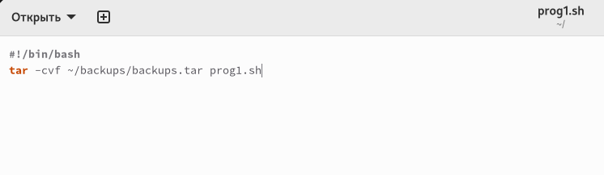
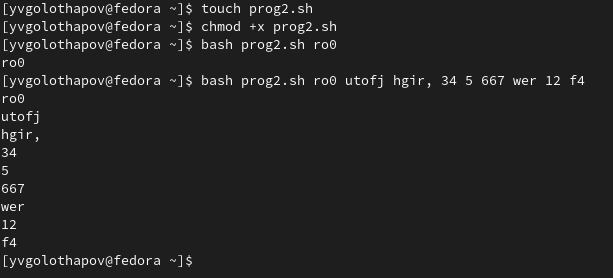
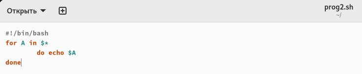
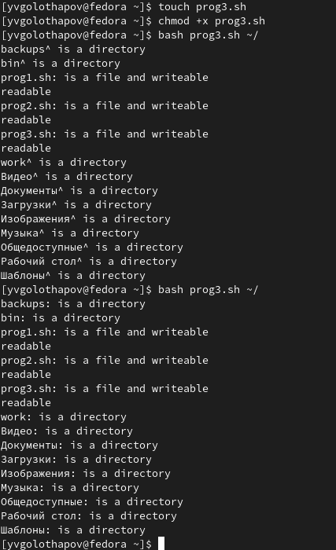
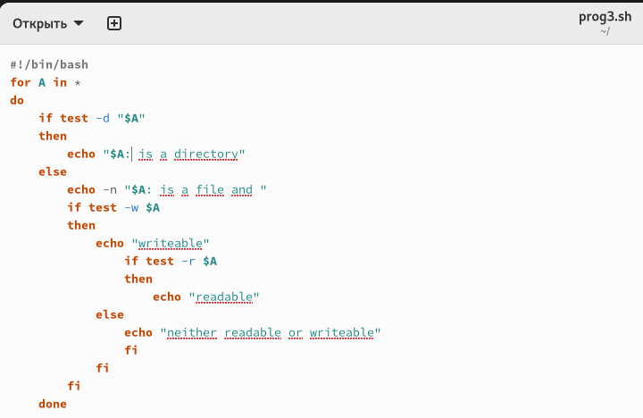
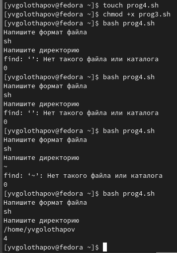
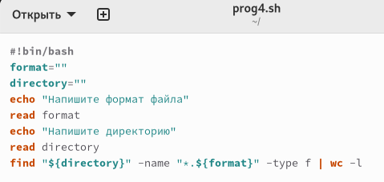

---
## Front matter
lang: ru-RU
title: Лабораторная работа 10
subtitle: Операционные системы
author:
  - Голощапов Я.В.
institute:
  - Российский университет дружбы народов, Москва, Россия
date: 15 апреля 2023

## i18n babel
babel-lang: russian
babel-otherlangs: english

## Formatting pdf
toc: false
toc-title: Содержание
slide_level: 2
aspectratio: 169
section-titles: true
theme: metropolis
header-includes:
 - \metroset{progressbar=frametitle,sectionpage=progressbar,numbering=fraction}
 - '\makeatletter'
 - '\beamer@ignorenonframefalse'
 - '\makeatother'
---

# Информация

## Докладчик

  * Голощапов Ярослав Вячеславович
  * студент 1-ого курса
  * Российский университет дружбы народов
  * <https://github.com/yvgoloschapov>

# Цель работы

## Цель работы

Изучить основы программирования в оболочке ОС UNIX/Linux. Научиться писать
небольшие командные файлы.

# Выполнение лабораторной работы 

## Выполнение лабораторной работы 

Создаю файл prog1.sh , в котором буду писать программу с расширением sh с помощью утилиты touch.

{#fig:001 width=70%}

## Выполнение лабораторной работы 

Пишу скрипт в файле 
{#fig:002 width=70%}

## Выполнение лабораторной работы 

Создаю файл prog2.sh

{#fig:003 width=70%}

## Выполнение лабораторной работы 

Пишу скрипт в файле prog2

{#fig:004 width=70%}

## Выполнение лабораторной работы 

Создаю файл prog3.sh

{#fig:005 width=70%}

## Выполнение лабораторной работы 

Пишу скрипт в файле prog3 

{#fig:006 width=70%}

## Выполнение лабораторной работы 

Создаю файл prog4.sh 

{#fig:007 width=70%}

## Выполнение лабораторной работы 

Пишу скрипт в файле prog4 

{#fig:008 width=70%}

# Вывод

## Вывод

При выполнении лабораторной работы я изучил основы программирования в оболочке ОС UNIX/Linux, научился писать
небольшие командные файлы.

:::

