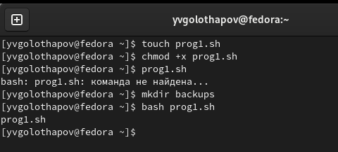
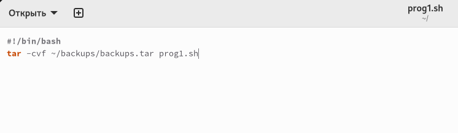
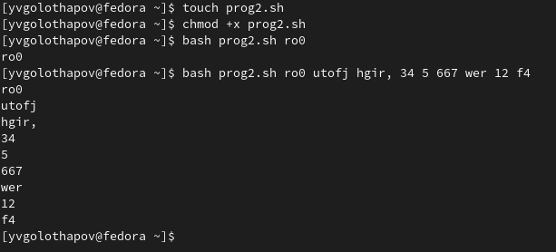
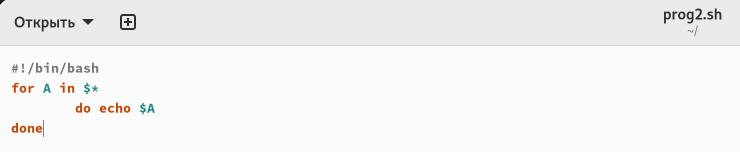
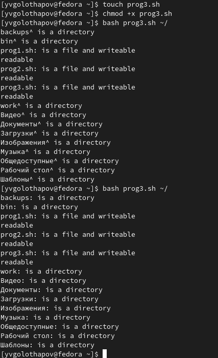
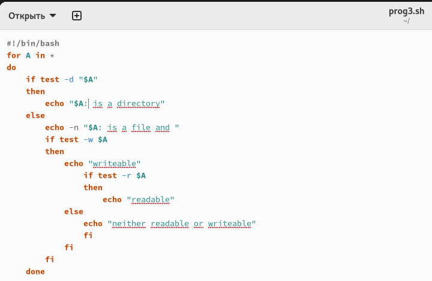
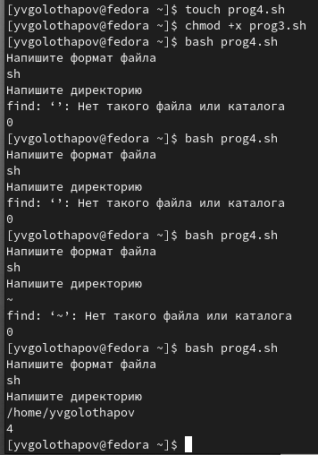
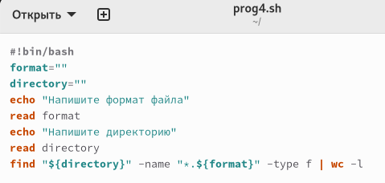

---
## Front matter
title: "Лабораторная работа 10"
subtitle: "Операционные системы"
author: "Голощапов Ярослав"

## Generic otions
lang: ru-RU
toc-title: "Содержание"

## Bibliography
bibliography: bib/cite.bib
csl: pandoc/csl/gost-r-7-0-5-2008-numeric.csl

## Pdf output format
toc: true # Table of contents
toc-depth: 2
lof: true # List of figures
lot: true # List of tables
fontsize: 12pt
linestretch: 1.5
papersize: a4
documentclass: scrreprt
## I18n polyglossia
polyglossia-lang:
  name: russian
  options:
	- spelling=modern
	- babelshorthands=true
polyglossia-otherlangs:
  name: english
## I18n babel
babel-lang: russian
babel-otherlangs: english
## Fonts
mainfont: PT Serif
romanfont: PT Serif
sansfont: PT Sans
monofont: PT Mono
mainfontoptions: Ligatures=TeX
romanfontoptions: Ligatures=TeX
sansfontoptions: Ligatures=TeX,Scale=MatchLowercase
monofontoptions: Scale=MatchLowercase,Scale=0.9
## Biblatex
biblatex: true
biblio-style: "gost-numeric"
biblatexoptions:
  - parentracker=true
  - backend=biber
  - hyperref=auto
  - language=auto
  - autolang=other*
  - citestyle=gost-numeric
## Pandoc-crossref LaTeX customization
figureTitle: "Рис."
tableTitle: "Таблица"
listingTitle: "Листинг"
lofTitle: "Список иллюстраций"
lotTitle: "Список таблиц"
lolTitle: "Листинги"
## Misc options
indent: true
header-includes:
  - \usepackage{indentfirst}
  - \usepackage{float} # keep figures where there are in the text
  - \floatplacement{figure}{H} # keep figures where there are in the text
---

# Цель работы

Изучить основы программирования в оболочке ОС UNIX/Linux. Научиться писать
небольшие командные файлы.

# Задание

1. Написать скрипт, который при запуске будет делать резервную копию самого себя (то
есть файла, в котором содержится его исходный код) в другую директорию backup
в вашем домашнем каталоге. При этом файл должен архивироваться одним из архиваторов на выбор zip, bzip2 или tar. Способ использования команд архивации
необходимо узнать, изучив справку.
2. Написать пример командного файла, обрабатывающего любое произвольное число
аргументов командной строки, в том числе превышающее десять. Например, скрипт
может последовательно распечатывать значения всех переданных аргументов.
3. Написать командный файл — аналог команды ls (без использования самой этой команды и команды dir). Требуется, чтобы он выдавал информацию о нужном каталоге
и выводил информацию о возможностях доступа к файлам этого каталога.
4. Написать командный файл, который получает в качестве аргумента командной строки
формат файла (.txt, .doc, .jpg, .pdf и т.д.) и вычисляет количество таких файлов
в указанной директории. Путь к директории также передаётся в виде аргумента командной строки.

# Теоретическое введение

При перечислении имён файлов текущего каталога можно использовать следующие
символы:
– * — соответствует произвольной, в том числе и пустой строке;
– ? — соответствует любому одинарному символу;
– [c1-c1] — соответствует любому символу, лексикографически находящемуся между
символами c1 и с2.
Например,
– echo * — выведет имена всех файлов текущего каталога, что представляет собой
простейший аналог команды ls;
– ls *.c — выведет все файлы с последними двумя символами, совпадающими с .c.
– echo prog.? — выведет все файлы, состоящие из пяти или шести символов, первыми
пятью символами которых являются prog..
– [a-z]* — соответствует произвольному имени файла в текущем каталоге, начинающемуся с любой строчной буквы латинского алфавита.
Такие символы, как ' < > * ? | \ " &, являются метасимволами и имеют для командного процессора специальный смысл. Снятие специального смысла с метасимвола
называется экранированием метасимвола. Экранирование может быть осуществлено с помощью предшествующего метасимволу символа \, который, в свою очередь, является
метасимволом.
Для экранирования группы метасимволов нужно заключить её в одинарные кавычки. Строка, заключённая в двойные кавычки, экранирует все метасимволы, кроме
$, ' , \, ". Например,
– echo \* выведет на экран символ *,
– echo ab’*\|*’cd выведет на экран строку ab*\|*cd.

# Выполнение лабораторной работы

Создаю файл prog1.sh , в котором буду писать программу с расширением sh с помощью утилиты touch (рис. @fig:001).

{#fig:001 width=70%}

Пишу скрипт в файле (рис. @fig:002)
{#fig:002 width=70%}

Создаю файл prog2.sh (рис. @fig:003)

{#fig:003 width=70%}

Пишу скрипт в файле prog2 (рис. @fig:004)

{#fig:004 width=70%}

Создаю файл prog3.sh (рис. @fig:005)

{#fig:005 width=70%}

Пишу скрипт в файле prog3 (рис. @fig:006)

{#fig:006 width=70%}

Создаю файл prog4.sh (рис. @fig:007)

{#fig:007 width=70%}

Пишу скрипт в файле prog4 (рис. @fig:008)

{#fig:008 width=70%}

# Вывод

При выполнении лабораторной работы я изучил основы программирования в оболочке ОС UNIX/Linux, научился писать
небольшие командные файлы.

