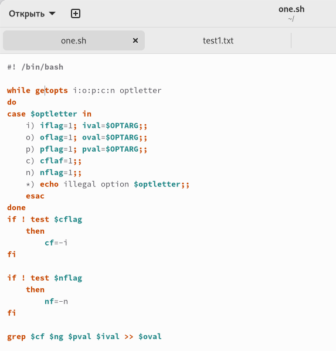
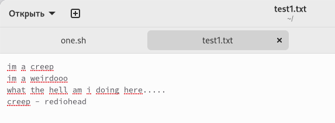
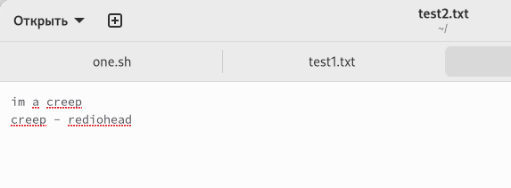
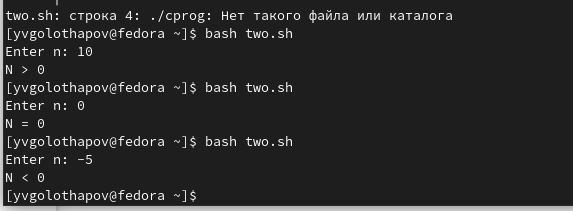
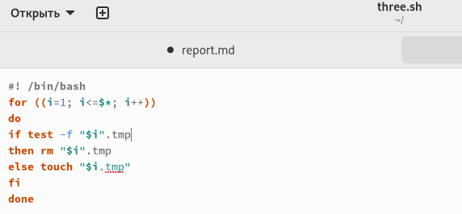
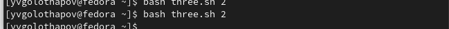
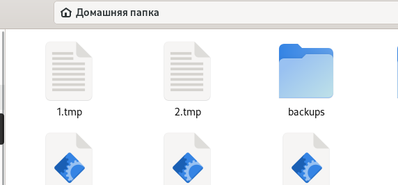
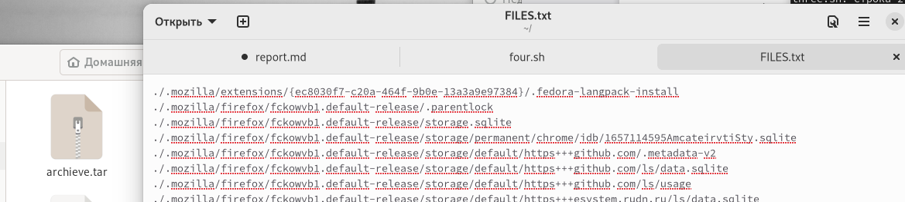

---
## Front matter
lang: ru-RU
title: Структура научной презентации
subtitle: Простейший шаблон
author:
  - Голощапов Я.В.
institute:
  - Российский университет дружбы народов, Москва, Россия
date: 22 апреля 2023

## i18n babel
babel-lang: russian
babel-otherlangs: english

## Formatting pdf
toc: false
toc-title: Содержание
slide_level: 2
aspectratio: 169
section-titles: true
theme: metropolis
header-includes:
 - \metroset{progressbar=frametitle,sectionpage=progressbar,numbering=fraction}
 - '\makeatletter'
 - '\beamer@ignorenonframefalse'
 - '\makeatother'
---

# Информация

## Докладчик

  * Голощапов Ярослав Вячеславович
  * Студент 1-го курса
  * Российский университет дружбы народов
  * <https://github.com/yvgoloschapov>

# Цель работы

## Цель работы

Изучить основы программирования в оболочке ОС UNIX. Научится писать более сложные командные файлы с использованием логических управляющих конструкций и циклов.

# Задание

## Задание

1. Используя команды getopts grep, написать командный файл, который анализирует командную строку с ключами:
- -iinputfile — прочитать данные из указанного файла;
- -ooutputfile — вывести данные в указанный файл;
- -pшаблон — указать шаблон для поиска;
- -C — различать большие и малые буквы;
- -n — выдавать номера строк.  
а затем ищет в указанном файле нужные строки, определяемые ключом -p.

## Задание

2. Написать на языке Си программу, которая вводит число и определяет, является ли оно больше нуля, меньше нуля или равно нулю. Затем программа завершается с помощью функции exit(n), передавая информацию в о коде завершения в оболочку. Командный файл должен вызывать эту программу и, проанализировав с помощью команды $?, выдать сообщение о том, какое число было введено.

## Задание

3. Написать командный файл, создающий указанное число файлов, пронумерованных последовательно от 1 до 𝑁 (например 1.tmp, 2.tmp, 3.tmp,4.tmp и т.д.). Число файлов, которые необходимо создать, передаётся в аргументы командной строки. Этот же командный файл должен уметь удалять все созданные им файлы (если они существуют).

## Задание

4. Написать командный файл, который с помощью команды tar запаковывает в архив все файлы в указанной директории. Модифицировать его так, чтобы запаковывались только те файлы, которые были изменены менее недели тому назад (использовать команду find).

# Выполнение лабораторной работы

Я создал файл one.sh для первой программы, а также текстовые файлы, откуда будет браться информация. Написал код программы.

{#fig:002 width=70%}

## Выполнение лабораторной работы

Запустил программу и проверил, работает ли она . Программа работает.

{#fig:004 width=70%}

{#fig:005 width=70%}

## Выполнение лабораторной работы

Создал файлы для второй программы: two.sh и two.c и заполнил код.

{#fig:007 width=70%}

## Выполнение лабораторной работы

Проверил работу командного файла.

{#fig:008 width=70%}

## Выполнение лабораторной работы

Создал третий файл three.sh и написал код.

{#fig:009 width=70%}

## Выполнение лабораторной работы

Запустил файл. Программа работает.

{#fig:010 width=70%}

{#fig:011 width=70%}

## Выполнение лабораторной работы

Создал файл four.sh.

{#fig:012 width=70%}

## Выполнение лабораторной работы

Программа работает.

{#fig:014 width=70%}

# Выводы

## Выводы

Я изучил основы программирования в оболочке ОС UNIX, а также научился писать более сложные командные файлы с использованием логических управляющих конструкций и циклов.

:::

