---
## Front matter
title: "Лабораторная работа №11"
subtitle: "Операционные системы"
author: "Голощапов Ярослав"

## Generic otions
lang: ru-RU
toc-title: "Содержание"

## Bibliography
bibliography: bib/cite.bib
csl: pandoc/csl/gost-r-7-0-5-2008-numeric.csl

## Pdf output format
toc: true # Table of contents
toc-depth: 2
lof: true # List of figures
lot: true # List of tables
fontsize: 12pt
linestretch: 1.5
papersize: a4
documentclass: scrreprt
## I18n polyglossia
polyglossia-lang:
  name: russian
  options:
	- spelling=modern
	- babelshorthands=true
polyglossia-otherlangs:
  name: english
## I18n babel
babel-lang: russian
babel-otherlangs: english
## Fonts
mainfont: PT Serif
romanfont: PT Serif
sansfont: PT Sans
monofont: PT Mono
mainfontoptions: Ligatures=TeX
romanfontoptions: Ligatures=TeX
sansfontoptions: Ligatures=TeX,Scale=MatchLowercase
monofontoptions: Scale=MatchLowercase,Scale=0.9
## Biblatex
biblatex: true
biblio-style: "gost-numeric"
biblatexoptions:
  - parentracker=true
  - backend=biber
  - hyperref=auto
  - language=auto
  - autolang=other*
  - citestyle=gost-numeric
## Pandoc-crossref LaTeX customization
figureTitle: "Рис."
tableTitle: "Таблица"
listingTitle: "Листинг"
lofTitle: "Список иллюстраций"
lotTitle: "Список таблиц"
lolTitle: "Листинги"
## Misc options
indent: true
header-includes:
  - \usepackage{indentfirst}
  - \usepackage{float} # keep figures where there are in the text
  - \floatplacement{figure}{H} # keep figures where there are in the text
---

# Цель работы

Изучить основы программирования в оболочке ОС UNIX. Научится писать более сложные командные файлы с использованием логических управляющих конструкций и циклов.

# Задание

1. Используя команды getopts grep, написать командный файл, который анализирует командную строку с ключами:
- -iinputfile — прочитать данные из указанного файла;
- -ooutputfile — вывести данные в указанный файл;
- -pшаблон — указать шаблон для поиска;
- -C — различать большие и малые буквы;
- -n — выдавать номера строк.  
а затем ищет в указанном файле нужные строки, определяемые ключом -p.

2. Написать на языке Си программу, которая вводит число и определяет, является ли оно больше нуля, меньше нуля или равно нулю. Затем программа завершается с помощью функции exit(n), передавая информацию в о коде завершения в оболочку. Командный файл должен вызывать эту программу и, проанализировав с помощью команды $?, выдать сообщение о том, какое число было введено.

3. Написать командный файл, создающий указанное число файлов, пронумерованных последовательно от 1 до 𝑁 (например 1.tmp, 2.tmp, 3.tmp,4.tmp и т.д.). Число файлов, которые необходимо создать, передаётся в аргументы командной строки. Этот же командный файл должен уметь удалять все созданные им файлы (если они существуют).

4. Написать командный файл, который с помощью команды tar запаковывает в архив все файлы в указанной директории. Модифицировать его так, чтобы запаковывались только те файлы, которые были изменены менее недели тому назад (использовать команду find).

# Теоретическое введение

При перечислении имён файлов текущего каталога можно использовать следующие
символы:
– * — соответствует произвольной, в том числе и пустой строке;
– ? — соответствует любому одинарному символу;
– [c1-c1] — соответствует любому символу, лексикографически находящемуся между
символами c1 и с2.
Например,
– echo * — выведет имена всех файлов текущего каталога, что представляет собой
простейший аналог команды ls;
– ls *.c — выведет все файлы с последними двумя символами, совпадающими с .c.
– echo prog.? — выведет все файлы, состоящие из пяти или шести символов, первыми
пятью символами которых являются prog..
– [a-z]* — соответствует произвольному имени файла в текущем каталоге, начинающемуся с любой строчной буквы латинского алфавита.
Такие символы, как ' < > * ? | \ " &, являются метасимволами и имеют для командного процессора специальный смысл. Снятие специального смысла с метасимвола
называется экранированием метасимвола. Экранирование может быть осуществлено с помощью предшествующего метасимволу символа \, который, в свою очередь, является
метасимволом.
Для экранирования группы метасимволов нужно заключить её в одинарные кавычки. Строка, заключённая в двойные кавычки, экранирует все метасимволы, кроме
$, ' , \, ". Например,
– echo \* выведет на экран символ *,
– echo ab’*\|*’cd выведет на экран строку ab*\|*cd.

# Выполнение лабораторной работы

Я создал файл one.sh для первой программы, а также текстовые файлы, откуда будет браться информация (рис. @fig:001). Написал код программы (рис. @fig:002).

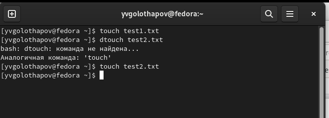{#fig:001 width=70%}

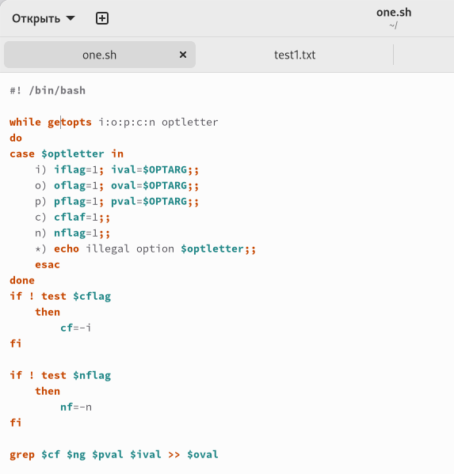{#fig:002 width=70%}

Запустил программу и проверил, работает ли она (рис. @fig:003). Программа работает (рис. @fig:004), (рис. @fig:005).

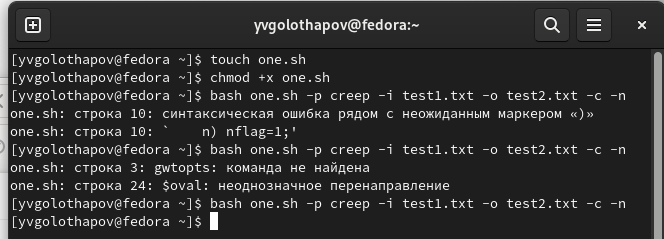{#fig:003 width=70%}

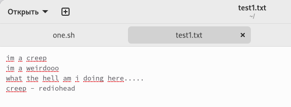{#fig:004 width=70%}

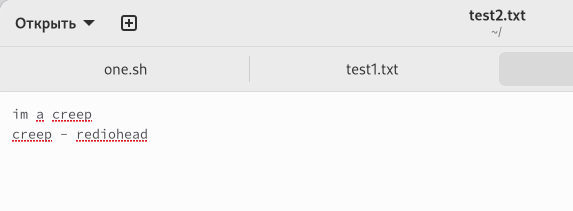{#fig:005 width=70%}

Создал файлы для второй программы: two.sh и two.c и заполнил код (рис. @fig:006), (рис. @fig:007).

{#fig:006 width=70%}

{#fig:007 width=70%}

Проверил работу командного файла (рис. @fig:008).

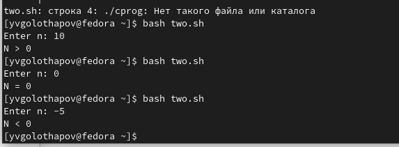{#fig:008 width=70%}

Создал третий файл three.sh и написал код (рис. @fig:009).

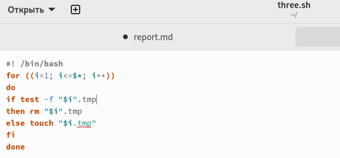{#fig:009 width=70%}

Запустил файл. Программа работает (рис. @fig:010), (рис. @fig:011).

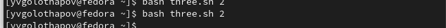{#fig:010 width=70%}

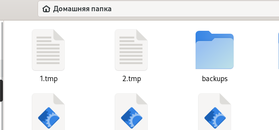{#fig:011 width=70%}

Создал файл four.sh (рис. @fig:012).

{#fig:012 width=70%}

Программа работает (рис. @fig:013), (рис. @fig:014).

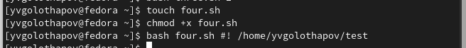{#fig:013 width=70%}

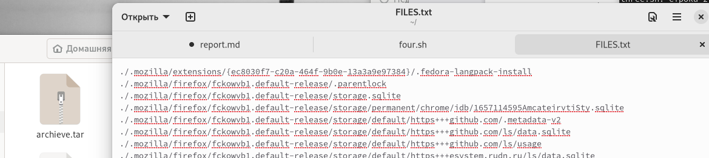{#fig:014 width=70%}

# Выводы

Я изучил основы программирования в оболочке ОС UNIX, а также научился писать более сложные командные файлы с использованием логических управляющих конструкций и циклов.

:::
